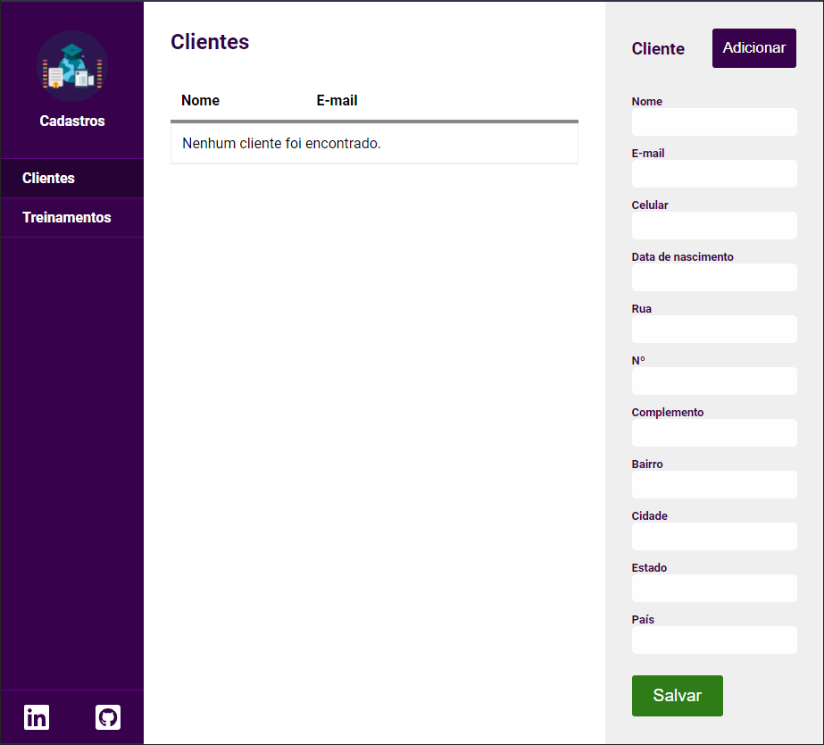

# Cadastro
Gestão de cadastros

   [](https://app.netlify.com/sites/quizzical-mclean-6ccaeb/deploys)

## Features

Criação de um sistema e-commerce para inventário de produtos e dados de clientes:

- Os dados de clientes, endereços e produtos devem estar devidamente estruturados;
- Dados no localstorage;
- Código fonte no github com o arquivo README detalhando as funcionalidades da programação;

## Visual



## Instalação

### Pré-requisitos

```
yarn add react-scripts
```

### Iniciar o servidor:

```
yarn start
```